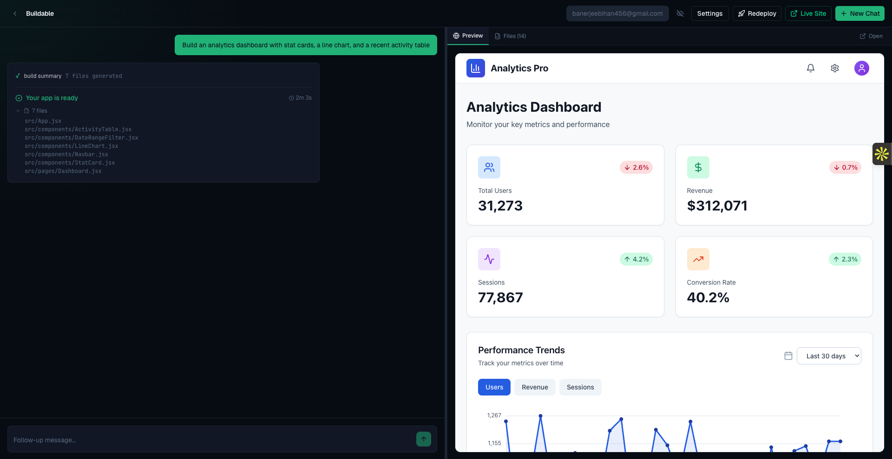
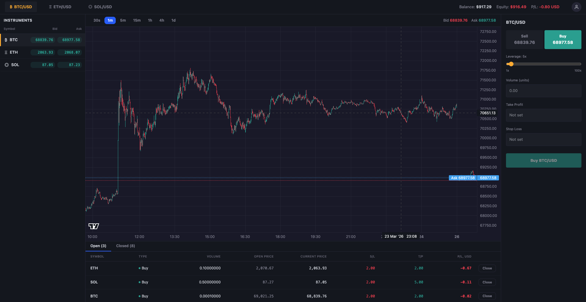

# Hey, I'm Bihan 👋

Full-stack AI engineer focused on building agentic systems.

Currently working on multi-agent orchestration, memory, and RAG.

I work across Python (FastAPI, LangGraph) and TypeScript (Node.js, React, Next.js), and ship everything to prod.

Currently at **100xSchool Super30** (Greater Noida, India) — intensive full-stack bootcamp focused on AI and Web3.

---

### Featured Projects

#### [Buildable](https://github.com/BihanBanerjee/Buildable) — AI-powered web app builder &nbsp; [Live →](https://buildable.bihanbanerjee.com)

`Python` `FastAPI` `LangGraph` `Next.js` `React` `TypeScript` `PostgreSQL` `E2B` `Cloudflare R2` `Docker` `Terraform` `Tailwind CSS`

> Describe what you want in plain English → a 6-node multi-agent pipeline (planner → scaffold → builder → checkpoint → fixer → app_start) generates production-ready React apps in an isolated sandbox. Iterative chat refinement with surgical edits, live preview, one-click ZIP export. BYOK via OpenRouter.

<!-- Replace with an actual screenshot: take a screenshot of buildable.bihanbanerjee.com and save as assets/buildable-preview.png -->
<!--  -->

---

#### [Velox Trading](https://github.com/BihanBanerjee/Velox-Trading) — Real-time leveraged crypto trading platform &nbsp; [Live →](https://app.velox.bihanbanerjee.com)

`TypeScript` `Next.js` `React` `Bun` `Express` `WebSocket` `Redis` `PostgreSQL` `TimescaleDB` `Prisma` `Docker` `Terraform` `Turborepo`

> 7 microservices communicating via Redis Streams. In-memory liquidation engine checking every price tick across all open positions. BigInt arithmetic (10^8 scale) for zero floating-point errors. Live Binance price feeds, candlestick aggregation across 7 timeframes, snapshot-based crash recovery with event replay. Up to 100x leverage on BTC/ETH/SOL perpetuals.

<!-- Replace with an actual screenshot: take a screenshot of app.velox.bihanbanerjee.com and save as assets/velox-preview.png -->
<!--  -->

---

### Currently Building

🧠 **[re-collect](https://github.com/BihanBanerjee/re-collect)** — A memory layer for AI agents
`Python`
> Persistent, structured memory that lets AI agents recall context across sessions.

🛠️ **[craftsman](https://github.com/BihanBanerjee/craftsman)** — AI-powered coding tool
`Python`
> A developer tool that leverages LLMs to assist with code generation, editing, and reasoning across codebases.

---

### Skills

`Agentic AI` `Multi-agent Orchestration` `RAG` `Memory Systems` `Tool Use` `Prompt Engineering` `LangChain` `LangGraph` `Pydantic` `FastAPI` `SQLAlchemy` `Microservices` `WebSockets` `Redis Streams` `Node.js` `Express` `React` `Prisma` `Zod` `JWT` `CI/CD` `Machine Learning` `Deep Learning` `PyTorch`

---

### Tech Stack

**Languages**

**Frontend**

**Backend**

**AI & LLM**

**Data & Infra**

---

### GitHub Stats

  
  

---

### Connect

---

📄 Published Research

 

**Monkeypox detection from skin lesion images using an amalgamation of CNN models aided with Beta function-based normalization scheme**

Pramanik R., **Banerjee B.**, Efimenko G., Kaplun D., Sarkar R. — *PLOS ONE*, 2023

[Paper](https://doi.org/10.1371/journal.pone.0281815) · [Code](https://github.com/BihanBanerjee/MonkeyPox)

**MSENet: Mean and standard deviation based ensemble network for cervical cancer detection**

Pramanik R., **Banerjee B.**, Sarkar R. — *Engineering Applications of Artificial Intelligence*, Elsevier, 2023

[Paper](https://doi.org/10.1016/j.engappai.2023.106336) · [Code](https://github.com/rishavpramanik/msenet)

